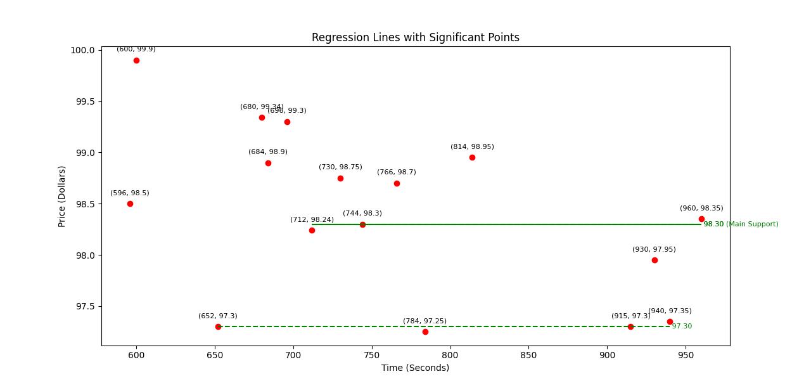
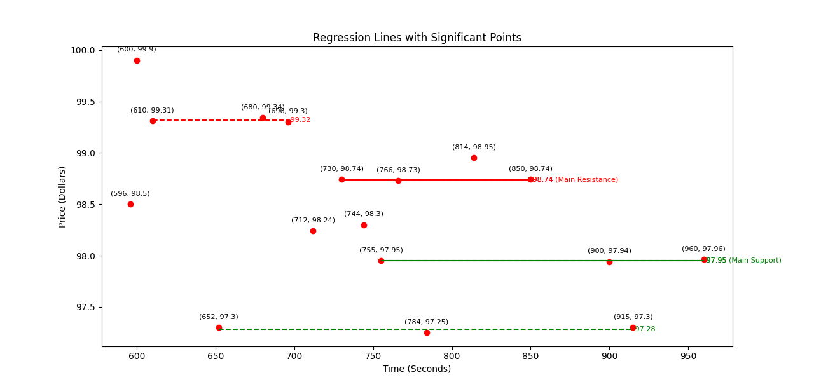
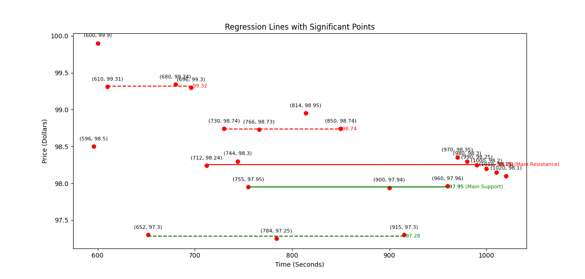
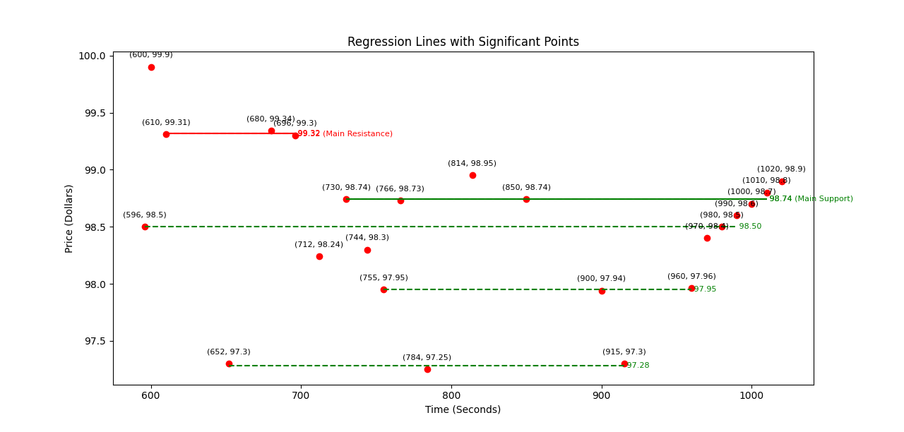
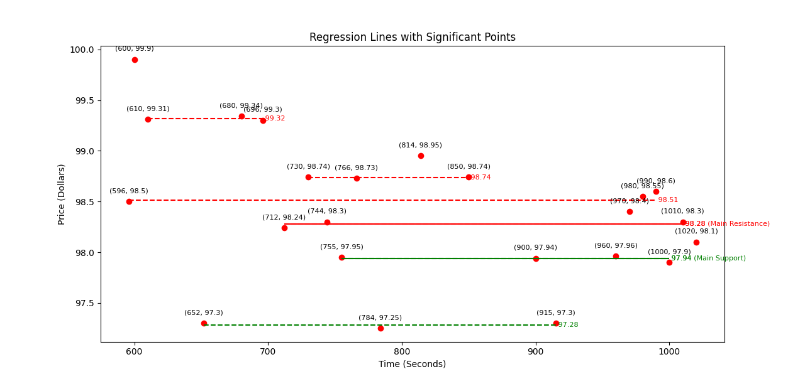

## Quant and Regression Based Trading

### Wyckoff Analysis
#### 2024-01-25 Sam's Update
##### Implemented: 
* Enable input as CSV file format
* Pass the CSV file path as a command-line argument
* Categorize regression lines into support/resistance lines
* Identify the main support/resistance line 
* Update plot visualization representation
* Categorization Switch between support/resistance lines

---

##### Usage: 

To run the program: 
``` 
python regression.py <csv_file_path>
```
</br>

Create an Instance: 
``` python
# WyckoffAnalysis instance
wyckoff_analysis = WyckoffAnalysis(regression_lines)
```
</br>

Regression Line Categorization: 
``` python
def basic_categorization(self, current_price)
(support_line, resis_line)= wyckoff_analysis.basic_categorization(current_price)
```
The function returns a tuple consisting the support and resistance lines
</br>

Categorization Switch:
``` python
wyckoff_analysis.categorization_switch(current_price)
```
</br>

Visualization: 
```python
def plot_regression_lines(regression_lines, significant_values, main_lines)
```

---

##### Test: 
* Original Input:
In the original scenario, two regression lines are established. With the current price at 960, the 98.30 line will be considered the main support regression line and the lower one will be the regular supporting regression line.


</br>
* Test 1: 
Test case #1’s data generated  4 regression lines with 2 being the supports and 2 being the resistance. Here we see that with the current price of 97.96, the main resistance line and the main support line are established accordingly.  



</br>

* Test 2:
In case #2, we are testing out the categorization switch functionality. The line of 98.25 started as a support line for the point (970, 98.35), but as the value kept on decreasing, the same main support line of 98.25 became the main resistance line when the current price reached the point (1020, 98.1). 



</br>

* Test 3: 
Case #3 is the opposite of case 2, as the current price increased, the original resistance line (814, 98.95) became the main support line as the current price resulted in (1020, 98.9)



</br>

* Test 4: 
Test case #4’s data plot simulates the price fluctuation and how the system would analyze each of the regression lines and categorize them accordingly. 



